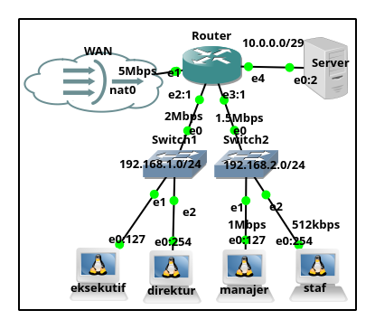

# qos
QoS (Quality of Service)



Tahapan Konfigurasi IP Public Static :
1. Set Identity Router
2. Set Nama Interface
3. Add IP Address
- IP address/ether1 = 192.168.122.2/24
- IP address/ether2 = 192.168.1.1/24
- IP address/ether3 = 192.168.2.0/24
- IP address/ether4 = 10.0.0.0/24
4. Set DNS
5. Add Routing
6. Set DHCP Server
7. Set Firewall
- Add NAT(SNAT) atau Masquerade
- Add Address list
- Add Mangle
8. Set QoS (queue)

```sh
# Konfigurasi Identity Router :
/system identity set name=R-QoS
# Konfigurasi menambah interface :
/interface ethernet
set [ find default-name=ether2 ] name=ether2-inet
set [ find default-name=ether3 ] name=ether3-pimpinan
set [ find default-name=ether4 ] name=ether4-staf
set [ find default-name=ether5 ] name=ether5-server
# Konfigurasi menambah IP Address :
/ip address
add address=192.168.122.2/24 interface=ether2-inet
add address=192.168.1.1/24 interface=ether3-pimpinan
add address=192.168.2.1/24 interface=ether4-staf
add address=10.0.0.1/29 interface=ether5-server
# Konfigurasi menambah DNS :
/ip dns set allow-remote-requests=yes servers=8.8.8.8,8.8.4.4
# Konfigurasi menambah Routing :
/ip route add gateway=192.168.122.1
# Konfigurasi menambah DHCP Server :
/ip pool 
add name=dhcp_pool1 ranges=192.168.1.128-192.168.1.254
add name=dhcp_pool2 ranges=192.168.2.128-192.168.2.254

/ip dhcp-server
add name=dhcp1 address-pool=dhcp_pool1 disabled=no interface=ether3-pimpinan 
add name=dhcp2 address-pool=dhcp_pool2 disabled=no interface=ether4-staf

/ip dhcp-server network
add address=192.168.1.0/24 dns-server=192.168.122.1,8.8.8.8,8.8.4.4 gateway=192.168.1.1
add address=192.168.2.0/24 dns-server=192.168.122.1,8.8.8.8,8.8.4.4 gateway=192.168.2.1

# Konfigurasi menambah NAT(SNAT) atau Masquerade :
/ip firewall nat 
add chain=srcnat src-address=192.168.1.0/24 out-interface=ether2-inet action=masquerade
add chain=srcnat src-address=192.168.2.0/24 out-interface=ether2-inet action=masquerade
add chain=srcnat src-address=10.0.0.0/24 out-interface=ether2-inet action=masquerade
```

QoS (Quality of Service)
```sh
##Konfigurasi Manajemen Bandwidth Router (R1)
/ip firewall address-list 
add address=192.168.0.0/16 list=AreaKantor
add address=192.168.1.0/24 list=PCPimpinan
add address=192.168.2.1-192.168.2.127 list=PCManajer
add address=192.168.2.128-192.168.2.254 list=PCStaf
#add address=192.168.0.0/24 list=AreaWLAN

/ip firewall mangle 
add chain=forward src-address-list=PCPimpinan \
    dst-address-list=!AreaKantor action=mark-connection new-connection-mark=Koneksi-PCPimpinan \
    passthrough=yes comment="Marking Koneksi PCPimpinan"
add chain=forward in-interface=ether3-pimpinan \
    connection-mark=Koneksi-PCPimpinan action=mark-packet new-packet-mark=PCPimpinan-Upload \
    passthrough=no comment="Marking Upload PCPimpinan"
add chain=forward in-interface=ether2-inet \
    connection-mark=Koneksi-PCPimpinan action=mark-packet new-packet-mark=PCPimpinan-Download \
    passthrough=no comment="Marking Download PCPimpinan"

#add chain=forward src-address-list=AreaWLAN \
#    dst-address-list=!AreaKantor action=mark-connection new-connection-mark=Koneksi-AreaWLAN \
#    passthrough=yes comment="Marking Koneksi AreaWLAN"
#add chain=forward in-interface=wlan1 \
#    connection-mark=Koneksi-AreaWLAN action=mark-packet new-packet-mark=AreaWLAN-Upload \
#    passthrough=no comment="Marking Upload AreaWLAN"
#add chain=forward in-interface=ether2-inet \
#    connection-mark=Koneksi-AreaWLAN action=mark-packet new-packet-mark=AreaWLAN-Download \
#    passthrough=no comment="Marking Download AreaWLAN"

add chain=forward src-address-list=PCManajer \
    dst-address-list=!AreaKantor action=mark-connection new-connection-mark=Koneksi-PCManajer \
    passthrough=yes comment="Marking Koneksi PCManajer"
add chain=forward in-interface=ether4-staf \
    connection-mark=Koneksi-PCManajer action=mark-packet new-packet-mark=PCManajer-Upload \
    passthrough=no comment="Marking Upload PCManajer"
add chain=forward in-interface=ether2-inet \
    connection-mark=Koneksi-PCManajer action=mark-packet new-packet-mark=PCManajer-Download \
    passthrough=no comment="Marking Download PCManajer"

add chain=forward src-address-list=PCStaf \
    dst-address-list=!AreaKantor action=mark-connection new-connection-mark=Koneksi-PCStaf \
    passthrough=yes comment="Marking Koneksi PCStaf"
add chain=forward in-interface=ether4-staf \
    connection-mark=Koneksi-PCStaf action=mark-packet new-packet-mark=PCStaf-Upload \
    passthrough=no comment="Marking Upload PCStaf"
add chain=forward in-interface=ether2-inet \
    connection-mark=Koneksi-PCStaf action=mark-packet new-packet-mark=PCStaf-Download \
    passthrough=no comment="Marking Download PCStaf"

/queue tree 
### Upload ###
add name=Global-Traffic parent=global queue=default 
add name=Total-Upload max-limit=5M queue=default \
    parent=Global-Traffic comment="Total Bandwidth Upload"
add name=PCPimpinan-Upload packet-mark=PCPimpinan-Upload \
    limit-at=2M max-limit=2M parent=Total-Upload queue=pcq-upload-default

#add name=AreaWLAN-Upload packet-mark=AreaWLAN-Upload \
#    limit-at=1M max-limit=1M parent=Total-Upload queue=pcq-upload-default

add name=AreaStaf-Upload max-limit=1536k queue=default \
    parent=Total-Upload
add name=PCManajer-Upload packet-mark=PCManajer-Upload \
    limit-at=1M max-limit=1M parent=AreaStaf-Upload queue=default
add name=PCStaf-Upload packet-mark=PCStaf-Upload \
    limit-at=512k max-limit=512k parent=AreaStaf-Upload queue=default

### Download ###
add name=Total-Download max-limit=5M queue=default \
    parent=Global-Traffic comment="Total Bandwidth Download"
add name=PCPimpinan-Download packet-mark=PCPimpinan-Download \
    limit-at=2M max-limit=2M parent=Total-Download queue=pcq-download-default

#add name=AreaWLAN-Download packet-mark=AreaWLAN-Download \
#    limit-at=20M max-limit=20M parent=Total-Download queue=pcq-download-default

add name=AreaStaf-Download max-limit=1536k queue=default \
    parent=Total-Download
add name=PCManajer-Download packet-mark=PCManajer-Download \
    limit-at=1M max-limit=1M parent=AreaStaf-Download queue=default
add name=PCStaf-Download packet-mark=PCStaf-Download \
    limit-at=512k max-limit=512k parent=AreaStaf-Download queue=default
```

verifikasi konfigurasi dari PC Clinet:
```sh
# PC Eksekutif
eksekutif:~# speedtest
Retrieving speedtest.net configuration...
Testing from Dinas Komunikasi dan Informatika Kota Pangkalpinan (103.179.69.9)...
Retrieving speedtest.net server list...
Selecting best server based on ping...
Hosted by BLiP (Denpasar) [965.13 km]: 31.998 ms
Testing download speed................................................................................
Download: 1.83 Mbit/s
Testing upload speed......................................................................................................
Upload: 2.05 Mbit/s

# PC Manajer
manajer:~# speedtest
Retrieving speedtest.net configuration...
Testing from Dinas Komunikasi dan Informatika Kota Pangkalpinan (103.179.69.9)...
Retrieving speedtest.net server list...
Selecting best server based on ping...
Hosted by BLiP (Denpasar) [965.13 km]: 32.675 ms
Testing download speed................................................................................
Download: 0.92 Mbit/s
Testing upload speed......................................................................................................
Upload: 1.14 Mbit/s

# PC Staf
staf:~# speedtest
Retrieving speedtest.net configuration...
Testing from Dinas Komunikasi dan Informatika Kota Pangkalpinan (103.179.69.9)...
Retrieving speedtest.net server list...
Selecting best server based on ping...
Hosted by BLiP (Denpasar) [965.13 km]: 33.489 ms
Testing download speed................................................................................
Download: 0.42 Mbit/s
Testing upload speed......................................................................................................
Upload: 0.71 Mbit/s
```

Tools Untuk Menguji Bandwith pada Interface
1. Speedtest
- sudo apt install speedtest-cli
- speedtest #cmd

2. Fast
- npm install --global fast-cli
- fast #cmd download
- fast -u #cmd upload

3. iPerf
- sudo apt install iperf
- iperf -s #cmd from side server
- iperf -c ip_server-target #cmd from client